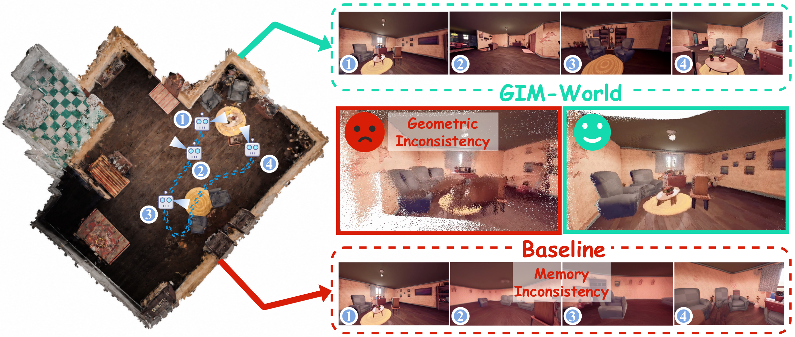
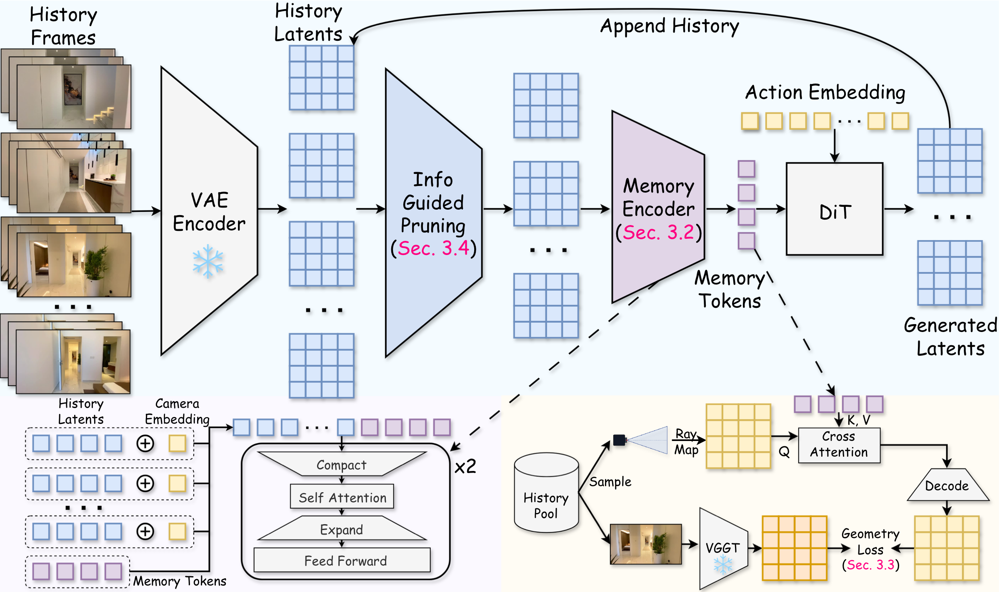

<div align="center">

<h1>GIM-World: Geometry-Aware Implicit Memory for Video World Models</h1>

<h4>SIGGRAPH Asia 2026</h4>

[Zhengxuan Wei](https://zhengxuanwei.top/)<sup>1,2\*</sup>, Xu Guo<sup>3,2\*</sup>, Xinghui Li<sup>2\*†</sup>, Xunzhi Xiang<sup>1</sup>, Min Wei<sup>2</sup>, Yiran Zhu<sup>2</sup>,
Qiulin Wang<sup>2</sup>, Xintao Wang<sup>2</sup>, Pengfei Wan<sup>2</sup>, Xiangwang Hou<sup>3</sup>, [Qi Fan](https://fanq15.github.io/)<sup>1†</sup>

<sup>1</sup>Nanjing University &nbsp; <sup>2</sup>Kling Team, Kuaishou Technology &nbsp; <sup>3</sup>Tsinghua University
<br><sup>\*</sup>Equal contribution &nbsp; <sup>†</sup>Corresponding author

<a href="https://gim-world.github.io/"></a>
<a href="https://arxiv.org/abs/2606.02436"></a>
<a href="https://huggingface.co/WeiZhengxuan/GIM-World"></a>
<a href="https://www.modelscope.cn/models/nagara214/GIM-World"></a>

</div>

<p align="center">
  
</p>

> **TL;DR** &nbsp; GIM-World compresses an arbitrarily long observation history into a fixed-size implicit memory whose content is supervised to encode 3D scene geometry. Long-horizon autoregressive rollouts stay geometrically coherent and visually consistent with the scene, while explicit-memory (frame retrieval / packing) and geometry-agnostic implicit-memory baselines drift.

## 🔥 News

- **[2026-09]** Inference code and checkpoints (first-person / third-person MIND) released.
- **[2026-06]** Paper on [arXiv](https://arxiv.org/abs/2606.02436).
- **[2026]** GIM-World is accepted to SIGGRAPH Asia 2026.

## 📋 Table of Contents

- [📖 Introduction](#-introduction)
- [🛠️ Installation](#️-installation)
- [⬇️ Download Models](#️-download-models)
- [🎮 Quick Start](#-quick-start)
- [🔑 Inference](#-inference)
  - [Input format](#input-format)
  - [Custom camera trajectories](#custom-camera-trajectories)
  - [Options](#options)
  - [Reproducing MIND mem_test](#reproducing-mind-mem_test)
- [📊 Results](#-results)
- [🗂️ Code layout](#️-code-layout)
- [📝 TODO](#-todo)
- [📚 Citation](#-citation)
- [📧 Contact](#-contact)
- [🙏 Acknowledgements](#-acknowledgements)

## 📖 Introduction

Video world models generate the future from past observations and actions, but a long rollout depends on what the model remembers once observations leave its context window. Explicit memories keep frames or an online 3D reconstruction and inherit retrieval heuristics, redundant appearance storage or reconstruction artifacts; implicit memories compress history into a compact state, but nothing constrains that state to encode cross-view geometry.

**GIM-World** is a geometry-aware implicit memory for video world models built on a Wan2.1-1.3B DiT backbone:

- **Implicit Memory Encoder** — two blocks of compact self-attention + FFN turn a variable-length, camera-indexed history into a fixed set of memory tokens; the tokens are concatenated with the target latents to condition the backbone. The encoder runs in < 0.3 % of the backbone's time.
- **Camera-Queryable Geometry Supervision** (training only) — a ray-map query of a sampled history camera reads the memory and is matched against frozen VGGT features, forcing the memory to store view-consistent geometry rather than an appearance cache. The geometry head and teacher are discarded at inference; the head and loss are provided for reference in [`gim/models/geometry_head.py`](gim/models/geometry_head.py) but are not used by `generate.py`.
- **Information-Guided Pruning** — before encoding, the history is reduced to a budget of K latents by greedily maximizing mutual information under a pose–time Gaussian-process kernel, so encoding cost stays bounded as the rollout grows.

<p align="center">
  
</p>

## 🛠️ Installation

```bash
conda create -n gim-world python=3.10 -y
conda activate gim-world
pip install -r requirements.txt
pip install flash-attn --no-build-isolation   # required by the Wan2.1 backbone
```

Tested with PyTorch >= 2.4 and CUDA 12.x on a single NVIDIA GPU (bf16 VAE / T5, fp32 DiT).

## ⬇️ Download Models

```bash
# Hugging Face (default) — adds one MIND example clip for the quick start
python download_models.py --with_example

# ModelScope mirror
python download_models.py --source modelscope --with_example
```

This fetches the Wan2.1-T2V-1.3B VAE / umT5 text encoder and the GIM-World checkpoints, and prints the paths to use below.

| Checkpoint | Trained on | Download |
|---|---|---|
| `GIM-World/first_person` | MIND first-person split | [HF](https://huggingface.co/WeiZhengxuan/GIM-World/tree/main/first_person) · [ModelScope](https://www.modelscope.cn/models/nagara214/GIM-World/files) |
| `GIM-World/third_person` | MIND third-person split | [HF](https://huggingface.co/WeiZhengxuan/GIM-World/tree/main/third_person) · [ModelScope](https://www.modelscope.cn/models/nagara214/GIM-World/files) |

Each checkpoint folder holds `transformer/` (DiT), `memory_encoder.safetensors`, `camera_proj.safetensors`, `action_embedding.safetensors` and a `config.json` with the inference hyper-parameters (480×832, 20-latent chunks, pruning budget 200).

## 🎮 Quick Start

```bash
bash run.sh
```

`run.sh` rolls out the example clip in `assets/examples/demo_scene` for 20 seconds after its `mark_time`, following the recorded camera trajectory, and writes `outputs/demo/demo_scene/video.mp4` (observed prefix + generated frames). Edit the variables at the top of `run.sh` to point at your own paths.

## 🔑 Inference

A single entry point handles everything end to end — VAE encoding of the prefix, text encoding, history pruning, autoregressive rollout and decoding — no offline preprocessing step.

```bash
python generate.py \
    --input  path/to/clip_dir \
    --output outputs/my_run \
    --gim_ckpt checkpoints/GIM-World/first_person \
    --wan_dir  checkpoints/Wan2.1-T2V-1.3B
```

### Input format

A clip is a directory in the [MIND](https://github.com/CSU-JPG/MIND) layout:

```
clip_dir/
├── video.mp4      # at least the observed prefix: frames [0, mark_time)
└── action.json
```

```jsonc
{
  "mark_time": 1465,          // first frame to generate
  "total_time": 4352,         // frames covered by "data"
  "caption": "...",           // optional text prompt
  "data": [                   // one entry per frame, prefix AND future
    {"time": 0,
     "ws": 0, "ad": 0, "ud": 0, "lr": 0,               // actions: 0 none, 1 +, 2 −
     "actor_pos": {"x": 2398.2, "y": -4672.6, "z": 168.6},   // cm (Unreal)
     "actor_rpy": {"x": 0, "y": 0, "z": -72.5},              // roll/pitch/yaw, degrees
     "camera_pos": {...}, "camera_rpy": {...}}       // third-person only
  ]
}
```

Frames `[0, mark_time)` of `video.mp4` are encoded as the initial history; entries `[mark_time, total_time)` of `data` provide the camera path and actions to follow. Positions are divided by 100 (cm → m) and expressed relative to the first history frame inside the model.

### Custom camera trajectories

Author an `action.json` for your own footage with a pose string:

```bash
# treat all frames of my_clip/video.mp4 as the prefix, then move forward 60 frames,
# turn right 20 frames, move forward 40 frames
python make_trajectory.py --clip_dir my_clip \
    --pose "w-60, right-20, w-40" \
    --caption "A quiet stone courtyard at dusk."
python generate.py --input my_clip --output outputs/my_clip --gim_ckpt ... --wan_dir ...
```

| Token | Meaning | Token | Meaning |
|---|---|---|---|
| `w` / `s` | move forward / backward | `up` / `down` | look up / down |
| `a` / `d` | move left / right | `left` / `right` | look left / right |
| `stay` | hold pose | | |

Each item is `<action>-<frames>`; speeds default to 5 cm/frame and 1°/frame (`--move_speed`, `--turn_speed`). If your prefix camera is not static, pass per-frame poses with `--prefix_pose_json`. For arbitrary paths, write `action.json` directly or use `gim.utils.trajectory.frames_from_keyframes`.

### Options

| Flag | Default | Description |
|---|---|---|
| `--max_seconds` | 20 | Stop this many seconds after `mark_time` (≤ 0: run to `total_time`) |
| `--num_steps` | 50 | Denoising steps per chunk (DPM-Solver++) |
| `--guide_scale` | 1.0 | Text CFG scale (1.0 = off) |
| `--pruning` | from config | `information_guided` (paper) or `uniform` |
| `--pruning_budget` | 200 | Max history latents kept before memory encoding |
| `--perspective` | from config | `1st` or `3rd`: which pose in `action.json` is the camera |
| `--caption` | from json | Override the text prompt |
| `--include_prefix` | off | Prepend the observed frames to the saved video |
| `--dry_run` | off | Encode, align and prune only (no diffusion) — quick sanity check |

Every 20-latent chunk corresponds to 77 frames (≈ 3.2 s at 24 fps).

### Reproducing MIND mem_test

Point `--input_root` at a MIND split; every sub-directory with `video.mp4` + `action.json` is a clip, and clips are sharded across the GPUs launched by `torchrun`:

```bash
torchrun --nproc_per_node=8 generate.py \
    --input_root MIND-Data/1st_data/test/mem_test \
    --output     outputs/gim_world/1st_data/mem_test \
    --gim_ckpt   checkpoints/GIM-World/first_person \
    --wan_dir    checkpoints/Wan2.1-T2V-1.3B

torchrun --nproc_per_node=8 generate.py \
    --input_root MIND-Data/3rd_data/test/mem_test \
    --output     outputs/gim_world/3rd_data/mem_test \
    --gim_ckpt   checkpoints/GIM-World/third_person \
    --wan_dir    checkpoints/Wan2.1-T2V-1.3B --perspective 3rd
```

The output tree `outputs/gim_world/{1st_data,3rd_data}/mem_test/{clip}/video.mp4` is exactly what the [official MIND evaluator](https://github.com/CSU-JPG/MIND) expects:

```bash
python src/process.py --gt_root MIND-Data --test_root outputs/gim_world --num_gpus 8
```

## 📊 Results

Quantitative comparison on the MIND memory test (from the paper, Table 1). Memory: per-frame reconstruction vs. ground truth; Action: relative pose error of the rendered trajectory; Geometry: normalized dense reprojection score.

<table>
<thead>
<tr><th rowspan="2">Method</th><th colspan="7">First-person</th><th colspan="7">Third-person</th></tr>
<tr><th>MSE↓</th><th>PSNR↑</th><th>SSIM↑</th><th>LPIPS↓</th><th>Trans↓</th><th>Rot↓</th><th>Reproj↑</th>
    <th>MSE↓</th><th>PSNR↑</th><th>SSIM↑</th><th>LPIPS↓</th><th>Trans↓</th><th>Rot↓</th><th>Reproj↑</th></tr>
</thead>
<tbody>
<tr><td>Matrix-Game 2.0</td><td>0.1188</td><td>–</td><td>–</td><td>–</td><td>0.0265</td><td>0.6914</td><td>–</td><td>0.1404</td><td>–</td><td>–</td><td>–</td><td>0.0622</td><td>0.9031</td><td>–</td></tr>
<tr><td>MIND-World</td><td>0.1035</td><td>–</td><td>–</td><td>–</td><td>0.0384</td><td>0.5534</td><td>–</td><td>0.1042</td><td>–</td><td>–</td><td>–</td><td>0.0321</td><td>0.3328</td><td>–</td></tr>
<tr><td>FramePack</td><td>0.0764</td><td>12.04</td><td>0.3763</td><td>0.7062</td><td>0.0269</td><td>0.6536</td><td>73.97</td><td>0.0735</td><td>12.23</td><td>0.3957</td><td>0.6770</td><td>0.0145</td><td>0.2852</td><td>70.82</td></tr>
<tr><td>Context-as-Memory</td><td>0.0706</td><td>12.50</td><td>0.3917</td><td>0.6953</td><td><b>0.0235</b></td><td>0.5697</td><td>66.14</td><td>0.0671</td><td>12.81</td><td>0.4051</td><td>0.6480</td><td>0.0241</td><td>0.4385</td><td>69.17</td></tr>
<tr><td>SSM memory</td><td>0.0796</td><td>11.96</td><td>0.3953</td><td>0.7439</td><td>0.0379</td><td>0.6702</td><td>53.95</td><td>0.0928</td><td>11.76</td><td>0.4037</td><td>0.6830</td><td>0.0201</td><td>0.2971</td><td>61.26</td></tr>
<tr><td><b>GIM-World</b></td><td><b>0.0614</b></td><td><b>13.40</b></td><td><b>0.4135</b></td><td><b>0.6304</b></td><td>0.0247</td><td><b>0.4126</b></td><td><b>81.70</b></td><td><b>0.0605</b></td><td><b>13.58</b></td><td><b>0.4303</b></td><td><b>0.5974</b></td><td><b>0.0106</b></td><td><b>0.1588</b></td><td><b>87.10</b></td></tr>
</tbody>
</table>

## 🗂️ Code layout

```
generate.py                 # single inference entry point
make_trajectory.py          # author action.json from a pose string
download_models.py          # fetch Wan2.1 VAE/T5 + GIM-World checkpoints (+ example clip)
gim/
  pipeline.py               # GIMWorldPipeline: encode -> prune -> rollout -> decode
  models/
    memory_encoder.py       # Implicit Memory Encoder (Sec. 3.2)
    dit.py                  # memory-conditioned Wan2.1 DiT, camera injection, chunk sampler
    action_embedding.py     # action embeddings
    geometry_head.py        # camera-queryable geometry head + L_geo (Sec. 3.3, training only)
  utils/
    pruning.py              # information-guided pruning (Sec. 3.4)
    camera.py               # poses, relative frames, latent <-> frame alignment
    video.py                # streaming Wan VAE encode / decode, mp4 I/O
    trajectory.py           # pose-string / keyframe -> action.json
wan/                        # trimmed Wan2.1 (DiT, VAE, umT5, flow-matching solver)
```

## 📝 TODO

- [x] Inference code
- [x] First-person / third-person checkpoints
- [x] Geometry head + loss (reference implementation)
- [ ] Training script

## 📚 Citation

```bibtex
@article{wei2026gim,
  title   = {Geometry-Aware Implicit Memory for Video World Models},
  author  = {Wei, Zhengxuan and Guo, Xu and Li, Xinghui and Xiang, Xunzhi and Wei, Min and Zhu, Yiran and Wang, Qiulin and Wang, Xintao and Wan, Pengfei and Hou, Xiangwang and Fan, Qi},
  journal = {arXiv preprint arXiv:2606.02436},
  year    = {2026}
}
```

## 📧 Contact

Questions and issues: open a GitHub issue or email **652026710025@smail.nju.edu.cn**.

## 🙏 Acknowledgements

GIM-World builds on [Wan2.1](https://github.com/Wan-Video/Wan2.1) (backbone, VAE, text encoder), is trained and evaluated on [MIND](https://github.com/CSU-JPG/MIND), and distills geometry from [VGGT](https://github.com/facebookresearch/vggt) during training. We thank the authors for releasing their work.

## License

Code derived from Wan2.1 is released under the [Apache 2.0 License](LICENSE); the GIM-World additions follow the same license.
